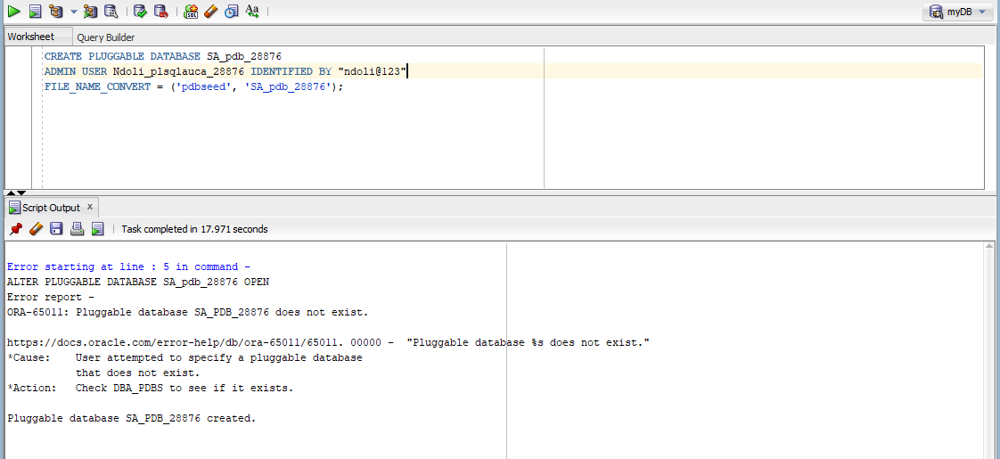
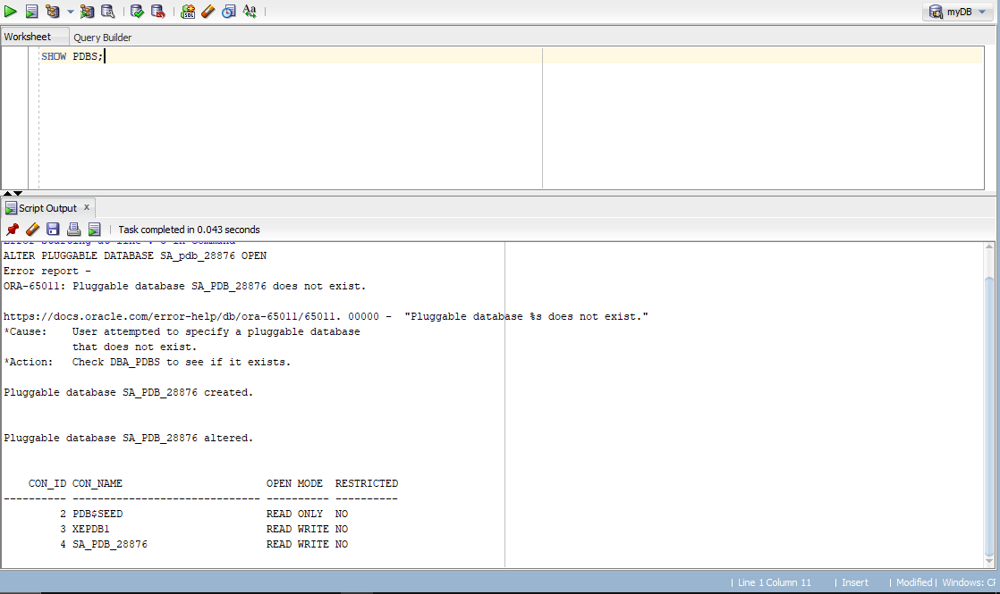
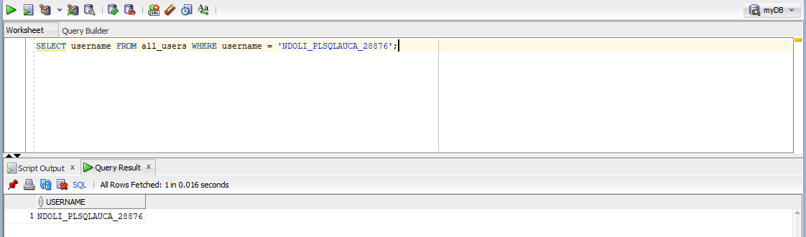
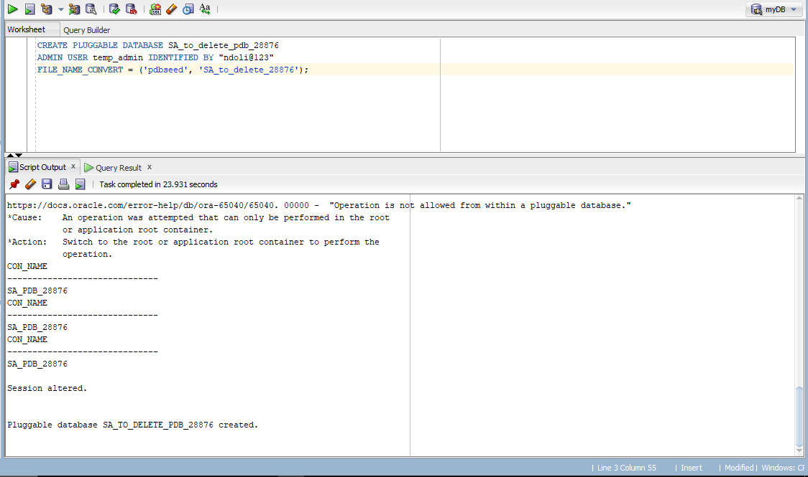
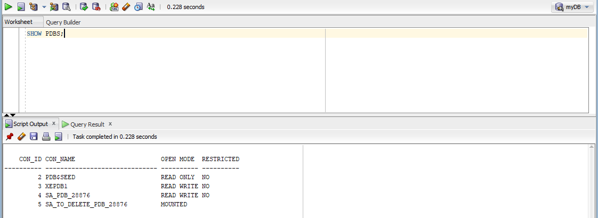
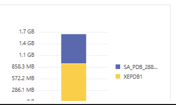

# Oracle PDB Management Assignment
**Student Name:** Ndoli  
**Student ID:** 28876  
**Course:** Database Development with PL/SQL (INSY 8311) 
**Instructor:** Eric Maniraguha 

---

## Overview
This repository contains the practical documentation for **Individual Assignment II**. The objective is to demonstrate proficiency in **Oracle Multitenant Architecture**, specifically the management, creation, and deletion of **Pluggable Databases (PDBs)**.

## Environment
* **Operating System:** Windows 11 (Microsoft Windows x86 64-bit)
* **Database Version:** Oracle Database 21c Express Edition (XE 21.3.0.0.0)
* **Client Tools:** Oracle SQL Developer and Oracle Enterprise Manager (OEM) Database Express 

---

## Tasks Performed

### Task 1: Permanent PDB & User Creation 
* **Objective:** Create a permanent PDB and a local administrative user for future class sessions.
* **Naming Conventions Followed:**
    * **PDB Name:** `SA_pdb_28876` 
    * **Username:** `Ndoli_plsqlauca_28876` 
* **Execution Steps:**
    1. Connected to the root container (`CDB$ROOT`) as `SYS AS SYSDBA`.
    2. Executed the `CREATE PLUGGABLE DATABASE` command.
    3. Opened the PDB to a `READ WRITE` state.
    4. Verified the user creation within the specific PDB container.

**Evidence:**
* 
* 
* 

---

### Task 2: PDB Lifecycle Management 
* **Objective:** Demonstrate the ability to manage the lifecycle of a database by creating and then completely removing a PDB.
* **Naming Convention Followed:** `SA_to_delete_pdb_28876` 
* **Execution Steps:**
    1. Created the temporary PDB successfully.
    2. Verified existence in the container list.
    3. Closed and dropped the PDB including all physical datafiles.
    4. Confirmed the database no longer exists in the environment.

**Evidence:**
* 
* 
* 

---

### [cite_start]Task 3: Oracle Enterprise Manager (OEM) 
* **Objective:** Access the web-based monitoring dashboard to verify environment health and PDB status.
* **Observation:** The OEM dashboard reflects the system environment and confirms that the permanent PDB (`SA_PDB_28876`) is integrated and recognized within the resource monitoring legend.

**Evidence:**
* 

---

## Challenges Faced & Solutions 
1. **Container Context Error (ORA-65040):** Encountered when attempting to manage PDBs while already connected to a specific PDB session.
    * **Solution:** Switched the session back to the root container using `ALTER SESSION SET CONTAINER = CDB$ROOT;`.
2. **Syntax Error (ORA-00922):** Password parsing issues occurred due to special characters.
    * **Solution:** Enclosed the administrative password in double quotes (`""`) to ensure it was interpreted correctly by the Oracle engine.

## Integrity Statement
I confirm that this work was completed individually and follows all academic integrity guidelines. All commands were executed personally, and screenshots reflect my unique database environment.

---
